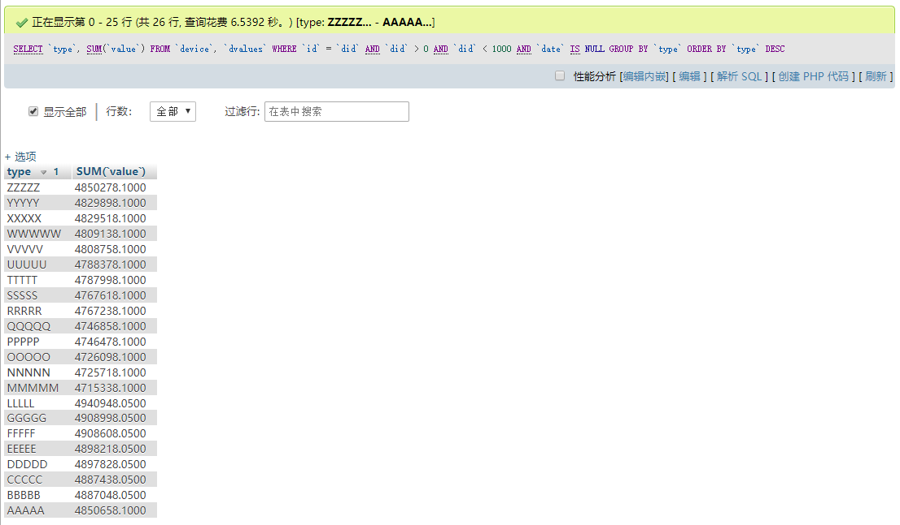
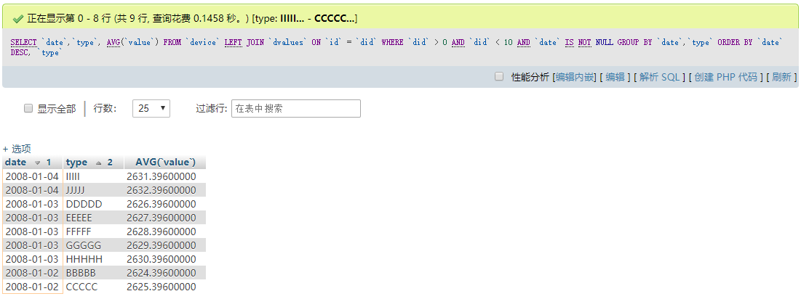
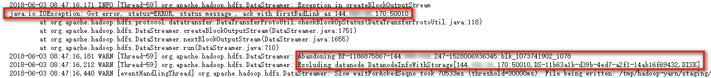

# Lab 4: Hadoop

## Building Hadoop Cluster

In this lab, I choose to deploy a Hadoop cluster on three cloud servers.

|  Role  |        OS        | CPU |   RAM   |  Storage  |  Location   |
| :----: | :--------------: | :-: | :-----: | :-------: | :---------: |
| master | Ubuntu 18.04 x64 |  1  | 2048 MB | 40 GB SSD | Los Angeles |
| slave1 | Ubuntu 18.04 x64 |  1  |  512 MB | 20 GB SSD |    Miami    |
| slave2 | Ubuntu 18.04 x64 |  1  | 1024 MB | 25 GB SSD | Los Angeles |

NOTE: We should make sure that machines have sufficient RAM, otherwise some Java processes might be killed by the kernel to release RAM space.

### Installing Java Environment

Execute the following commands on all the three machines, which install OpenJDK 11 and set the `JAVA_HOME` environment variable:

```
root@master:~# apt update
root@master:~# apt install default-jdk
root@master:~# find / -name java
/usr/share/bash-completion/completions/java
/usr/share/java
/usr/bin/java
/usr/lib/jvm/java-11-openjdk-amd64/bin/java
/var/lib/dpkg/alternatives/java
/etc/apparmor.d/abstractions/ubuntu-browsers.d/java
/etc/alternatives/java
/etc/ssl/certs/java
root@master:~# echo JAVA_HOME=\"/usr/lib/jvm/java-11-openjdk-amd64\" >> /etc/environment
root@master:~# source /etc/environment
```

NOTE: We should make sure that three machines have the same version of JDK, otherwise Hadoop execution on cluster will fail.

### Installing Hadoop

Execute the following commands on all the three machines, which install Hadoop 2.9.1 and set its directories for executables into `PATH`:

```
root@master:~# wget http://www-us.apache.org/dist/hadoop/common/hadoop-2.9.1/hadoop-2.9.1.tar.gz
root@master:~# tar -xzvf hadoop-2.9.1.tar.gz
root@master:~# echo export PATH=\$PATH:\~/hadoop-2.9.1/bin:\~/hadoop-2.9.1/sbin >> .bashrc
root@master:~# source .bashrc
```

NOTE: We should use the same user on the three machines to configure and execute Hadoop in the following steps. Now we are using the root user for convenience, but it is not a good practice to do so in real production environments.

### Network Configuration

In `/etc/hostname` of each machine, make sure hostnames of each machine are correctly configured to `master`, `slave1` and `slave2` respectively.

In `/etc/hosts` of each machine, set up the hostname-address bindings:

```
<ip-of-master> master
<ip-of-slave1> slave1
<ip-of-slave2> slave2
```

NOTE: Do not fill in `127.0.0.1` here for any IP, otherwise some ports may only bind the loopback interface and cannot be connected by other machines.

Then generate an SSH key pair on master using `ssh-keygen -t rsa`, and add the content of `~/.ssh/id_rsa.pub` to the `~/.ssh/authorized_keys` files of all the three machines. This allows master to connect to the two slaves and also itself through SSH without password.

Finally, we should set up firewall on master to deny inbound connections to ports 8088 and 8090 to prevent unauthorized access to YARN, which may lead to remote code execution!

```
root@master:~# ufw default allow
root@master:~# ufw deny 8088
root@master:~# ufw deny 8090
root@master:~# ufw enable
```

(For convenience, here we have allowed all inbound connections by default but blacklisted ports 8088 and 8090. In real production environments, it is strongly recommended that we only allow whitelisted ports to be connected.)

### Configuring Hadoop

Edit the following configuration files in the directory `~/hadoop-2.9.1/etc/hadoop` on master:

#### `slaves`

```
master
slave1
slave2
```

#### `core-site.xml`

```xml
<configuration>
    <property>
        <name>fs.defaultFS</name>
        <value>hdfs://master:9000</value>
    </property>
    <property>
        <name>hadoop.tmp.dir</name>
        <value>/root/hadoop-2.9.1/tmp</value>
        <description>Abase for other temporary directories.</description>
    </property>
</configuration>
```

#### `hdfs-site.xml`

```xml
<configuration>
    <property>
        <name>dfs.namenode.secondary.http-address</name>
        <value>master:50090</value>
    </property>
    <property>
        <name>dfs.replication</name>
        <value>3</value>
    </property>
    <property>
        <name>dfs.namenode.name.dir</name>
        <value>file:///root/hadoop-2.9.1/tmp/dfs/name</value>
    </property>
    <property>
        <name>dfs.datanode.data.dir</name>
        <value>file:///root/hadoop-2.9.1/tmp/dfs/data</value>
    </property>
</configuration>
```

#### `mapred-site.xml`

```xml
<configuration>
    <property>
        <name>mapreduce.framework.name</name>
        <value>yarn</value>
    </property>
    <property>
        <name>mapreduce.jobhistory.address</name>
        <value>master:10020</value>
    </property>
    <property>
        <name>mapreduce.jobhistory.webapp.address</name>
        <value>master:19888</value>
    </property>
</configuration>
```

#### `yarn-site.xml`

```xml
<configuration>
    <property>
        <name>yarn.resourcemanager.hostname</name>
        <value>master</value>
    </property>
    <property>
        <name>yarn.nodemanager.aux-services</name>
        <value>mapreduce_shuffle</value>
    </property>
</configuration>
```

Also, we copy the configuration files to the two slaves:

```
root@master:~/hadoop-2.9.1# scp -r ./etc slave1:~/hadoop-2.9.1/
root@master:~/hadoop-2.9.1# scp -r ./etc slave2:~/hadoop-2.9.1/
```

## Preparing Data Files

We import the two SQL files into MySQL, and export the two tables to CSV format.

### `device.csv`

```
0,AAAAA,building
1,BBBBB,square
2,CCCCC,street
3,DDDDD,shoping-mall
4,EEEEE,grass-land
5,FFFFF,building
...
```

### `dvalues.csv`

```
0,2008-01-01,1999.0100
0,2008-01-01,1888.1200
0,2008-01-01,1777.2300
0,2008-01-01,1666.3400
0,2008-01-01,1555.4500
0,2008-01-01,1444.5600
0,2008-01-01,1333.6700
0,2008-01-01,1222.7800
0,2008-01-01,1111.8900
0,2008-01-01,2234.9100
0,NULL,1123.4500
...
```

## Designing Hadoop Applications

Since all the statistical work revolves around the `dvalues` table, and the `device` table is only used to look up the `did`-`type` mappings, we preload all these mappings to a `HashMap` in the mapper class. In the mapper, we filter data according to the requirement, look up the `did`-`type` mapping and emit a new key-value pair if necessary. Value is converted from text to double. In the reducer, we perform statistics on key-value pairs with the same keys. We also have to define our customized comparators to sort data by the keys in ascending / descending order according to the requirement.

We save our source code as `DeviceStats1.java` and `DeviceStats2.java`. Now we compile them into jar files.

```
root@master:~/hadoop-2.9.1# hadoop com.sun.tools.javac.Main DeviceStats1.java
root@master:~/hadoop-2.9.1# jar cf ds1.jar DeviceStats1*.class
root@master:~/hadoop-2.9.1# hadoop com.sun.tools.javac.Main DeviceStats2.java
root@master:~/hadoop-2.9.1# jar cf ds2.jar DeviceStats2*.class
```

## Running Hadoop Applications

First of all, we start all the services:

```
root@master:~/hadoop-2.9.1# start-dfs.sh
root@master:~/hadoop-2.9.1# start-yarn.sh
root@master:~/hadoop-2.9.1# mr-jobhistory-daemon.sh start historyserver
```

We can verify that all services have successfully started using `jps` on each machine:

```
root@master:~/hadoop-2.9.1# jps
2275 Jps
22484 SecondaryNameNode
23000 JobHistoryServer
22217 DataNode
22940 NodeManager
22717 ResourceManager
22047 NameNode
```

```
root@slave1:~/hadoop-2.9.1# jps
8065 Jps
3875 DataNode
7820 NodeManager
```

```
root@slave2:~/hadoop-2.9.1# jps
5280 DataNode
5516 NodeManager
17199 Jps
```

Also, the `hdfs dfsadmin -report` command will report three live datanodes.

Before the first run, we should format HDFS namenode:

```
root@master:~/hadoop-2.9.1# hdfs namenode -format
```

Then we load our data files into HDFS:

```
root@master:~/hadoop-2.9.1# hdfs dfs -mkdir -p /user/root
root@master:~/hadoop-2.9.1# hdfs dfs -mkdir input
root@master:~/hadoop-2.9.1# hdfs dfs -mkdir preload
root@master:~/hadoop-2.9.1# hdfs dfs -put dvalues.csv input
root@master:~/hadoop-2.9.1# hdfs dfs -put device.csv preload
```

Now we run our first application:

```
root@master:~/hadoop-2.9.1# hadoop jar ds1.jar DeviceStats1
```

We can monitor our job in the web interface. After some time, the job finishes. We can view the output:

```
root@master:~/hadoop-2.9.1# hdfs dfs -cat output/*
ZZZZZ   4850278.099999995
YYYYY   4829898.099999997
XXXXX   4829518.099999996
WWWWW   4809138.099999996
VVVVV   4808758.099999996
UUUUU   4788378.099999995
TTTTT   4787998.099999997
SSSSS   4767618.099999997
RRRRR   4767238.099999995
QQQQQ   4746858.099999994
PPPPP   4746478.099999995
OOOOO   4726098.099999997
NNNNN   4725718.099999995
MMMMM   4715338.099999995
LLLLL   4940948.049999997
KKKKK   4930558.049999997
JJJJJ   4930168.049999996
IIIII   4919778.049999994
HHHHH   4919388.049999996
GGGGG   4908998.049999998
FFFFF   4908608.049999998
EEEEE   4898218.049999997
DDDDD   4897828.049999996
CCCCC   4887438.049999997
BBBBB   4887048.049999998
AAAAA   4850658.099999997
```

It is the same as the query result of this SQL:

```sql
SELECT `type`, SUM(`value`) FROM `device`, `dvalues`
WHERE `id` = `did` AND `did` > 0 AND `did` < 1000 AND `date` IS NULL
GROUP BY `type` ORDER BY `type` DESC;
```

<p><div align="center"></div></p>

Before running the second application, we should clear the `output` directory:

```
root@master:~/hadoop-2.9.1# hdfs dfs -rm -r output
```

Now we run our second application:

```
root@master:~/hadoop-2.9.1# hadoop jar ds2.jar DeviceStats2
root@master:~/hadoop-2.9.1# hdfs dfs -cat output/*
2008-01-04      IIIII   2631.3959999999997
2008-01-04      JJJJJ   2632.3959999999997
2008-01-03      DDDDD   2626.3959999999997
2008-01-03      EEEEE   2627.3959999999997
2008-01-03      FFFFF   2628.3959999999997
2008-01-03      GGGGG   2629.3959999999997
2008-01-03      HHHHH   2630.3959999999997
2008-01-02      BBBBB   2624.3959999999997
2008-01-02      CCCCC   2625.3959999999997
```

The result is the same as the query result of this SQL:

```sql
SELECT `date`, `type`, AVG(`value`) FROM `device` LEFT JOIN `dvalues` ON `id` = `did`
WHERE `did` > 0 AND `did` < 10 AND `date` IS NOT NULL
GROUP BY `date`, `type` ORDER BY `date` DESC, `type`;
```

<p><div align="center"></div></p>

Finally, we stop all the services:

```
root@master:~/hadoop-2.9.1# stop-yarn.sh
root@master:~/hadoop-2.9.1# stop-dfs.sh
root@master:~/hadoop-2.9.1# mr-jobhistory-daemon.sh stop historyserver
```

## Fault Tolerant Mechanism Validation

During the process of a job, we set up a firewall on slave1 to block network connections between master and slave1 to simulate a network partitioning phenomenon:

```
root@slave1:~/hadoop-2.9.1# ufw default allow
root@slave1:~/hadoop-2.9.1# ufw deny from <ip-of-master>
root@slave1:~/hadoop-2.9.1# ufw enable
```

In container logs of master, we found:

<p><div align="center"></div></p>

The dead datanode (slave1) is abandoned by master, and master continues to work with other remaining datanodes smoothly. This validates the fault tolerant mechanism of Hadoop.
